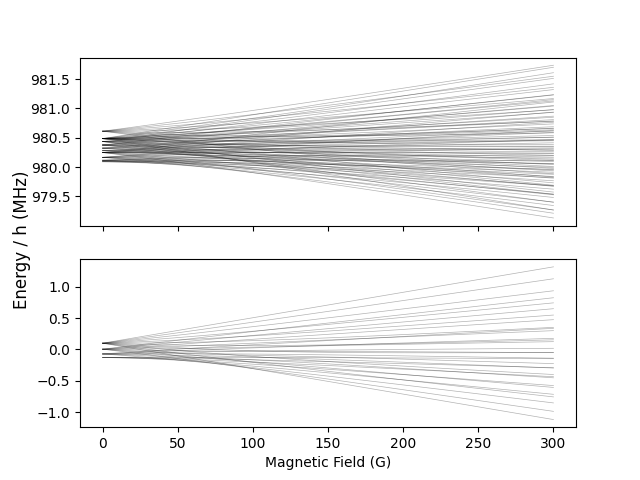

diatomic-py
===========

.. image:: https://github.com/durham-qlm/diatomic-py/actions/workflows/code_quality.yml/badge.svg?event=push&branch=master
    :alt: Code Quality Status
    :target: https://github.com/durham-qlm/diatomic-py/actions/workflows/code_quality.yml

.. image:: https://github.com/durham-qlm/diatomic-py/actions/workflows/test-suite.yml/badge.svg?event=push&branch=master
    :alt: Test Suite Status
    :target: https://github.com/durham-qlm/diatomic-py/actions/workflows/test-suite.yml

Python package to calculate the hyperfine energy levels of singlet sigma diatomic molecules (e.g. RbCs, KCs and KRb) under various applied fields.
The hyperfine structure can be calculated in static electric and magnetic fields and, when provided the polarisability, oscillating electric fields.

More detailed information can be found in the documentation at https://diatomic-py.readthedocs.io .

Diatomic-py is licensed under a BSD 3 clause license, a copy can be found `here <LICENSE>`_.

If you use our work for academic purposes you can cite us using:

J.A.Blackmore *et al.* Diatomic-py: A python module for calculating the rotational and hyperfine structure of :math:`^1\Sigma` molecules, [Arxiv *e-prints* 2205.05686](https://arxiv.org/abs/2205.05686) (2022).

This work has continued to evolve since the release of the paper, and so the API is different.

PyPi Installation
-----------------
This form of the package is not currently available on PyPI

Manual Installation
-------------------
Clone the repository:

.. code-block:: shell

    git clone https://github.com/durham-qlm/diatomic-py.git
    cd diatomic-py

It is recommended to then install the python package into virtual environment:

.. code-block:: shell

    # You may need to substitute `python` for `python3` if you're on macOS
    python -m venv ./venv
    source ./venv/bin/activate
    # After activating the virtual env you should only need `python`
    python --version
    which python

The below installation commands assume you are active in such an environment.
You can then install the package, there are various options indicated inside
the square brackets for the command types:

.. code-block:: shell

    # Installs essentials + matplotlib
    python -m pip install ".[plotting]"

    # OR if you also want to run test suite:
    python -m pip install ".[test,plotting]"
    pytest

    # OR if you want to develop code for the package
    python -m pip install -e ".[dev,plotting]"
    pre-commit install

Example
-------
.. code-block:: python

    import numpy as np
    import matplotlib.pyplot as plt
    import scipy.constants

    from diatomic.systems import SingletSigmaMolecule
    import diatomic.operators as operators
    import diatomic.calculate as solver

    GAUSS = 1e-4  # T
    MHz = scipy.constants.h * 1e6

    # Generate Molecule
    mol = SingletSigmaMolecule.from_preset("Rb87Cs133")
    mol.Nmax = 2

    # Generate Hamiltonians
    H0 = operators.hyperfine_ham(mol)
    Hz = operators.zeeman_ham(mol)

    # Parameter Space
    B = np.linspace(0.001, 300, 50) * GAUSS

    # Overall Hamiltonian
    Htot = H0 + Hz * B[:, None, None]

    # Solve (diagonalise) Hamiltonians
    eigenenergies, eigenstates = solver.solve_system(Htot)

    # Plot results
    fig, (ax_up, ax_down) = plt.subplots(2, 1, sharex=True)

    ax_down.plot(B / GAUSS, eigenenergies[:, 0:32] / MHz, c="k", lw=0.5, alpha=0.3)
    ax_up.plot(B / GAUSS, eigenenergies[:, 32:128] / MHz, c="k", lw=0.5, alpha=0.3)

    ax_down.set_xlabel("Magnetic Field (G)")
    fig.supylabel("Energy / h (MHz)")

    plt.show()

For more examples of usage, see the ``./examples`` folder.
